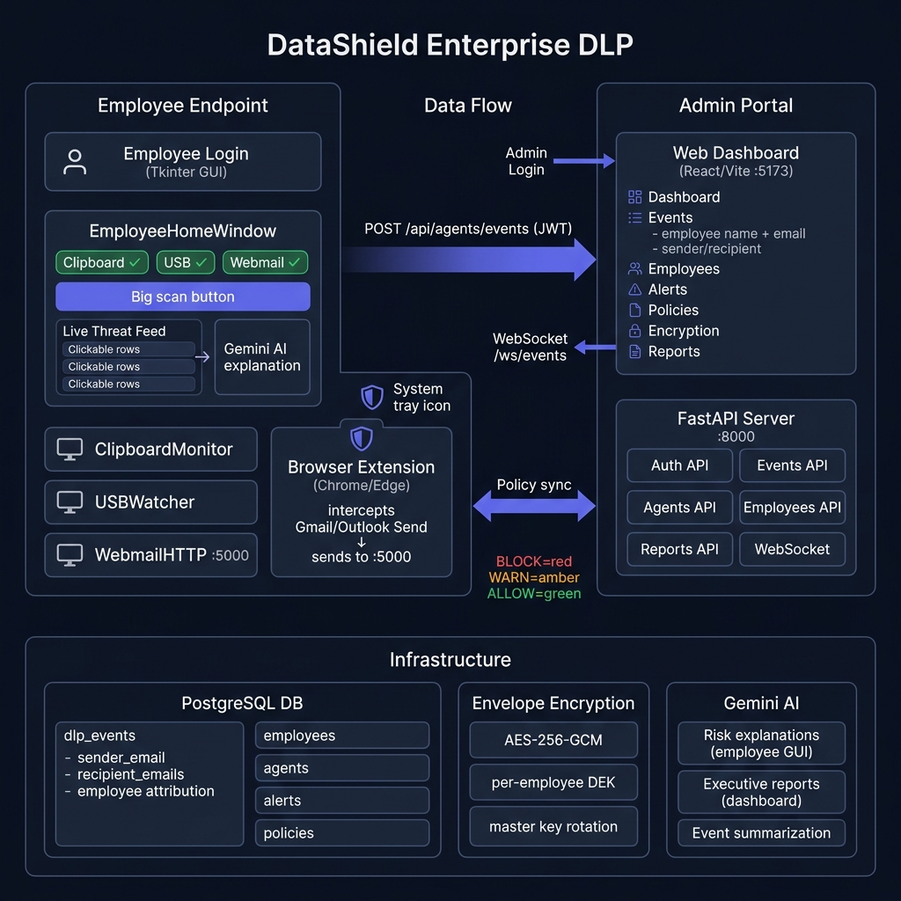

# DataShield Enterprise DLP

> **Enterprise-grade Data Loss Prevention** — multi-component, AI-powered, encryption-first.  
> Built as an internship project demonstrating real-world DLP architecture.



---

## What It Does

DataShield monitors and prevents sensitive data from leaving your organisation across all major channels:

| Channel | How it's monitored |
|---|---|
| 📂 **Files** | Scan before sending — employee picks folder, agent scans with 40+ DLP patterns |
| 📧 **Webmail** | Browser extension intercepts Gmail / Outlook compose before Send fires |
| 📋 **Clipboard** | Background monitor flags paste of sensitive content |
| 💾 **USB** | Detects insertion, scans files copied to removable drives |

Every violation is:
- Encrypted per-employee (AES-256-GCM envelope encryption)
- Reported to the central server in real-time via WebSocket
- Scored by a risk engine with time-of-day, volume, and repeat multipliers
- Explained by Gemini AI (shown to the employee inline, and in the admin dashboard)

---

## Architecture

```
┌─────────────────────────────────────────────────────────────────────┐
│  EMPLOYEE MACHINE                                                   │
│                                                                     │
│  main.py (login)                                                    │
│      ↓                                                              │
│  EmployeeHomeWindow (Tkinter)                                       │
│    ├── Monitor pills (Clipboard · USB · Webmail)                    │
│    ├── Scan Folder button → results + Gemini AI explanation        │
│    └── Live Threat Feed (click any row for AI explanation)         │
│                                                                     │
│  Background threads:                                                │
│    ClipboardMonitor · USBWatcher · WebmailHTTPServer (:5000)       │
│                                                                     │
│  Browser Extension (Chrome/Edge MV3)                               │
│    └── Intercepts Gmail/Outlook Send → POST /scan → BLOCK/WARN    │
└────────────────┬────────────────────────────────────────────────────┘
                 │ POST /api/agents/events  (JWT auth)
                 │ WebSocket /ws/events     (live feed)
                 ▼
┌─────────────────────────────────────────────────────────────────────┐
│  FASTAPI SERVER  (:8000)                                            │
│                                                                     │
│  API Routes:                                                        │
│    /api/auth        Login (admin → dashboard, employee → agent)    │
│    /api/agents      Register · Heartbeat · Event ingest            │
│    /api/events      List with employee attribution + email details  │
│    /api/employees   Profiles · Timeline · Flag/Unflag              │
│    /api/alerts      Acknowledge · Escalate                         │
│    /api/policies    YAML import · Push to agents                   │
│    /api/reports     Compliance metrics · Gemini executive summary  │
│    /ws/events       Live WebSocket broadcast                        │
│                                                                     │
│  Services:                                                          │
│    alert_engine.py  — severity scoring, deduplication, SMTP        │
│    behaviour.py     — risk score: base × volume × time × repeat    │
│    crypto_service.py — AES-256-GCM per-employee DEK management    │
└────────────────┬────────────────────────────────────────────────────┘
                 │
                 ▼
┌─────────────────────────────────────────────────────────────────────┐
│  INFRASTRUCTURE                                                     │
│                                                                     │
│  PostgreSQL                                                         │
│    dlp_events  (employee_id, channel, risk_level,                  │
│                 sender_email, recipient_emails, email_subject,      │
│                 file_path_encrypted, matched_value_redacted)        │
│    employees   (risk_score, is_flagged, encrypted_dek)             │
│    agents      (heartbeat, policy_version)                         │
│    alerts      (severity, escalation_count)                        │
│    policies    (yaml_content, version)                             │
│                                                                     │
│  Gemini AI  — Inline employee explanations + dashboard reports     │
└─────────────────────────────────────────────────────────────────────┘
```

---

## Quick Start

### 1. Server
```bash
cd server
pip install -r requirements.txt
cp .env.example .env        # fill in DB, JWT secret, Gemini key
python init_db.py           # seeds admin@datashield.local
uvicorn main:app --reload
```

### 2. Dashboard (Admin)
```bash
cd dashboard
npm install
npm run dev                 # opens http://localhost:5173
```
Login: `admin@datashield.local` / `Admin@123`

### 3. Employee Agent
```bash
pip install -r requirements.txt
cp .env.example .env        # fill in SERVER_URL, GEMINI_API_KEY
python main.py              # login dialog appears
```

### 4. Browser Extension
- Open `chrome://extensions` → Enable Developer mode
- Click **Load unpacked** → select `browser_extension/` folder
- Extension activates on Gmail and Outlook Web

---

## Key Technical Decisions

| Decision | Rationale |
|---|---|
| **Per-employee DEK** | If one key leaks, only that employee's events are exposed |
| **Alert deduplication** | Same pattern within 4h increments `escalation_count` instead of flooding |
| **Risk multipliers** | Off-hours events (22:00–06:00) × 1.3, high-volume × 1.5, repeat pattern × 1.4 |
| **Browser extension MV3** | Future-proof (MV2 deprecated by Chrome), service-worker based |
| **Tkinter not Electron** | No Node.js dependency, single `python main.py` command, no build step |

---

## Roles

| Role | Access |
|---|---|
| `superadmin` | Full access: policies, encryption key rotation, all events (decrypted) |
| `analyst` | Events (decrypted), employees, alerts — no policy changes |
| `viewer` | Read-only dashboard metrics |
| `employee` | Agent only — sees own threats, can scan folders |

---

## Files Changed in `enterp` Branch

| File | What changed |
|---|---|
| `gui/main_window.py` | Replaced tabbed window with focused EmployeeHomeWindow — scan button, live threat feed, AI explanation on click, logout, connection status |
| `comms/http_server.py` | Fixed import bug; captures sender/recipient for webmail events |
| `browser_extension/` | New — MV3 Chrome/Edge extension for Gmail/Outlook interception |
| `server/api/events.py` | Events now return employee_name, email, dept; email sender/recipient |
| `server/models/event.py` | Added sender_email, recipient_emails, email_subject columns |
| `dashboard/src/pages/Events.tsx` | Expandable rows showing employee + email attribution |
| `main.py` | Unified login, logout callback, server ping, monitor feed wiring |
