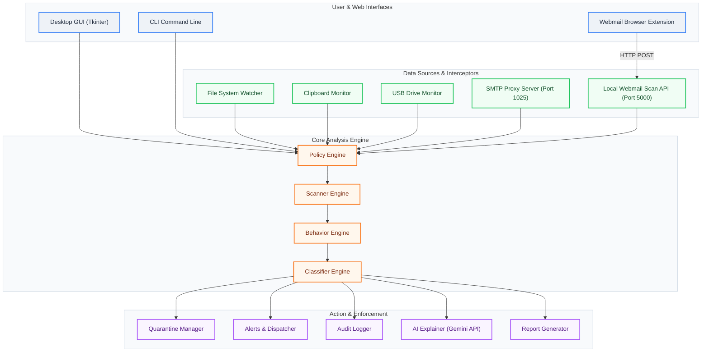

# DataShield v2 — Python DLP Scanner & Classifier

DataShield v2 is a fully functional, enterprise-grade academic prototype of a Data Loss Prevention (DLP) desktop application. It scans local files and folders for sensitive data patterns (such as PII, financial data, access keys, and medical codes), classifies their threat level, performs Shannon entropy analysis to detect high-entropy secrets, and checks for disguised file type extensions. It generates detailed HTML reports with optional Gemini-powered AI remediation explanations, all while maintaining a tamper-evident, SHA-256 chained audit ledger.

## System Architecture

### Enterprise Architecture (v2.0 — `enterp` branch)

DataShield Enterprise is a multi-tier system. Endpoint agents on user machines forward DLP events to a central FastAPI server, which stores and analyses them. A React dashboard provides real-time visibility.

```mermaid
graph TB
    classDef agent   fill:#0f172a,stroke:#6366f1,color:#e2e8f0,stroke-width:2px
    classDef server  fill:#0f172a,stroke:#f97316,color:#e2e8f0,stroke-width:2px
    classDef db      fill:#0f172a,stroke:#22c55e,color:#e2e8f0,stroke-width:2px
    classDef dash    fill:#0f172a,stroke:#8b5cf6,color:#e2e8f0,stroke-width:2px
    classDef ext     fill:#0f172a,stroke:#f59e0b,color:#e2e8f0,stroke-width:2px
    classDef ai      fill:#0f172a,stroke:#ec4899,color:#e2e8f0,stroke-width:2px

    subgraph ENDPOINT ["🖥️  Endpoint Agent  (User Machine)"]
        direction TB
        GUI["Desktop GUI\nTkinter"]:::agent
        subgraph INTERCEPTORS ["Interceptors"]
            direction LR
            FILE["File\nWatcher"]:::agent
            CLIP["Clipboard\nMonitor"]:::agent
            USB["USB\nMonitor"]:::agent
            SMTP["SMTP\nProxy :1025"]:::agent
            WMAPI["Webmail\nAPI :5000"]:::agent
        end
        subgraph ENGINE ["Core Engine"]
            direction LR
            POLICY["Policy\nEngine"]:::agent
            SCAN["Scanner\nEngine"]:::agent
            BEHAV["Behaviour\nEngine"]:::agent
            CLASS["Classifier\nEngine"]:::agent
        end
        AUDIT["SHA-256 Chained\nAudit Log"]:::agent
        RC["Reporting\nClient"]:::agent
    end

    subgraph BROWSER ["🌐  Browser Extension"]
        EXT["Chrome / Edge\nWebmail Extension"]:::ext
    end

    subgraph CENTRAL ["⚙️  Central Server  (FastAPI + Uvicorn)"]
        direction TB
        subgraph APIS ["REST API Routes"]
            direction LR
            AUTH["/api/auth\nJWT Login"]:::server
            AGAPI["/api/agents\nRegister · Heartbeat\nEvent Ingest"]:::server
            EMPAPI["/api/employees\nCRUD · Flag"]:::server
            EVAPI["/api/events\nFiltered Log"]:::server
            POLAPI["/api/policies\nYAML Import · Push"]:::server
            ALTAPI["/api/alerts\nAck · Resolve"]:::server
            REPAPI["/api/reports\nMetrics · AI Summary"]:::server
            ENCAPI["/api/encryption\nKey Status · Rotate"]:::server
        end
        WS["/ws/events\nWebSocket Live Feed"]:::server
        subgraph SERVICES ["Services"]
            direction LR
            CRYPTO["Envelope\nEncryption\nPBKDF2 → DEK\nAES-256-GCM"]:::server
            ALERTENG["Alert\nEngine\n4h dedup\nSMTP dispatch"]:::server
            BEHAVSVC["Behaviour\nService\nRisk score\n15min anomaly"]:::server
            POLPUSH["Policy\nPusher"]:::server
        end
    end

    subgraph STORAGE ["🗄️  PostgreSQL Database"]
        direction LR
        TBL1["employees\n+ encrypted_dek"]:::db
        TBL2["dlp_events\n+ encrypted fields"]:::db
        TBL3["alerts"]:::db
        TBL4["agents\npolicies"]:::db
    end

    subgraph DASHBOARD ["📊  React Dashboard  (Vite + nginx)"]
        direction TB
        subgraph PAGES ["Pages"]
            direction LR
            PG1["Dashboard\nMetrics · Charts"]:::dash
            PG2["Employees\nHeatmap · Flag"]:::dash
            PG3["Events\nFiltered Log"]:::dash
            PG4["Policies\nYAML Editor"]:::dash
            PG5["Alerts\nAck · Resolve"]:::dash
            PG6["Encryption\nKey Rotation"]:::dash
            PG7["Reports\nAI Summary"]:::dash
        end
        LIVEFEED["⚡ Live Feed\nWebSocket"]:::dash
    end

    GEMINI["✨ Gemini AI API\nExecutive Summary"]:::ai

    %% Endpoint flows
    FILE & CLIP & USB & SMTP & WMAPI --> POLICY
    POLICY --> SCAN --> BEHAV --> CLASS
    CLASS --> AUDIT
    CLASS --> RC
    GUI --> POLICY
    EXT -->|"HTTP POST\n:5000"| WMAPI

    %% Agent → Server
    RC -->|"POST /api/agents/events\nX-DataShield-Agent-Key"| AGAPI

    %% Server internal
    AGAPI --> CRYPTO
    AGAPI --> ALERTENG
    AGAPI --> BEHAVSVC
    POLAPI --> POLPUSH
    REPAPI --> GEMINI
    CRYPTO <-->|"AES-256-GCM\nDEK per employee"| TBL2
    ALERTENG --> WS

    %% Server → DB
    AGAPI & EMPAPI & EVAPI & POLAPI & ALTAPI & REPAPI & ENCAPI <--> TBL1 & TBL2 & TBL3 & TBL4

    %% Dashboard → Server
    PAGES -->|"Bearer JWT\nREST calls"| APIS
    LIVEFEED -->|"ws://\nJWT token"| WS

    style ENDPOINT   fill:#0b0f1a,stroke:#6366f1,stroke-width:2px,color:#e2e8f0
    style BROWSER    fill:#0b0f1a,stroke:#f59e0b,stroke-width:2px,color:#e2e8f0
    style CENTRAL    fill:#0b0f1a,stroke:#f97316,stroke-width:2px,color:#e2e8f0
    style STORAGE    fill:#0b0f1a,stroke:#22c55e,stroke-width:2px,color:#e2e8f0
    style DASHBOARD  fill:#0b0f1a,stroke:#8b5cf6,stroke-width:2px,color:#e2e8f0
    style INTERCEPTORS fill:#111827,stroke:#6366f1,stroke-dasharray:4
    style ENGINE       fill:#111827,stroke:#f97316,stroke-dasharray:4
    style APIS         fill:#111827,stroke:#f97316,stroke-dasharray:4
    style SERVICES     fill:#111827,stroke:#f97316,stroke-dasharray:4
    style PAGES        fill:#111827,stroke:#8b5cf6,stroke-dasharray:4
```



### v1 Standalone Architecture

The original standalone DLP agent (still fully functional on `main`):



## Features & Comparison

### Comparison Table

| Feature | Microsoft Purview DLP | Forcepoint DLP | Trellix DLP | DataShield v2 (Academic Prototype) |
| :--- | :--- | :--- | :--- | :--- |
| **Regex & Pattern Engine** | Yes (Enterprise Rules) | Yes (Custom / Out of box) | Yes | Yes (Configurable YAML & Built-in) |
| **Proximity Engine** | Yes | Yes | Yes | Yes (Doubles weights if patterns are near) |
| **Entropy Scan** | Yes (Custom sensitive) | Yes (Fingerprinting) | Yes | Yes (Shannon Entropy for tokens $\ge 20$) |
| **File Type Detection** | Magic Bytes & Mime | Magic Bytes & Mime | Magic Bytes | Magic Bytes (Checks first 8 bytes) |
| **Audit Chaining** | Cloud Ledger / SIEM | Local SQL Ledger | Proprietary DB | Local SHA-256 Chained Hash Log |
| **AI Explanation** | Microsoft Copilot | Cloud Integration | No | Gemini API Integration (local caching) |
| **Quarantine Engine** | Yes | Yes | Yes | Yes (Moves file and creates sidecar JSON) |
| **Live Monitoring** | Yes (Windows agent) | Yes | Yes | Yes (Watchdog engine) |

## File & Module Structure

| Module | Responsibility |
| :--- | :--- |
| `main.py` | Launches GUI or CLI depending on arguments. |
| `scanner.py` | Regex patterns, Luhn check, PDF/Word scanning, and path sandboxing. |
| `behaviour.py` | Proximity analysis, Shannon entropy calculation, high entropy strings, magic bytes validation. |
| `classifier.py` | Combines match weights, applies proximity multipliers, outputs final risk score/level. |
| `policy.py` | Rule loading from YAML, allowlist filtering, regulation mapping. |
| `reporter.py` | HTML report layout via Jinja2, CSS visual graphs, CSV exporting via pandas. |
| `quarantine.py` | Safe file relocation via shutil and sidecar metadata file creation. |
| `audit.py` | Tamper-evident chained blockchain-like JSON audit logger. |
| `ai_explain.py` | Gemini API connection, compliance/risk context generation, query caching. |
| `alerts.py` | Plyer system tray notifications and SMTP dispatching. |
| `watcher.py` | Real-time file change monitoring with watchdog. |

## Installation & Setup

1. **Clone or navigate to the directory**:
   ```bash
   cd C:\Users\HP\.gemini\antigravity\scratch\datashield
   ```

2. **Create a virtual environment (venv) and activate it**:
   On Windows:
   ```powershell
   python -m venv venv
   .\venv\Scripts\Activate.ps1
   ```
   On Linux/macOS:
   ```bash
   python3 -m venv venv
   source venv/bin/activate
   ```

3. **Install dependencies**:
   ```bash
   pip install -r requirements.txt
   ```

4. **Environment Variables**:
   Copy `.env.example` to `.env`:
   ```bash
   copy .env.example .env
   ```
   Edit `.env` to include your `GEMINI_API_KEY` for AI explanations, or you can input it live in the GUI Settings tab.

## Usage

### 1. GUI Mode (Default)
To launch the Tkinter GUI:
```bash
python main.py
```
This opens the desktop application with three tabs: **Scan**, **Results**, and **Settings**.

### 2. CLI Mode
To run a fast, headless scan on a target directory (such as our demo vault) and output to a reports folder:
```bash
python main.py --cli --path ./demo_vault --output ./output
```

### 3. Docker Mode
You can build and run DataShield v2 inside Docker (CLI mode by default):
```bash
docker build -t datashield .
docker run --rm -v ${PWD}/output:/app/output datashield
```

## Demo Vault Structure
We provide a simulated sandboxed structure in `demo_vault/` to demonstrate all patterns:
- `HIGH_RISK/employee_records.csv`: Triggers Aadhaar/PAN proximity, resulting in a HIGH risk classification.
- `HIGH_RISK/patient_data.txt`: Contains health keywords & ICD-10 medical codes.
- `HIGH_RISK/config.env`: Plain-text AWS keys and secrets.
- `MEDIUM_RISK/contacts_export.csv`: Triggers phone/email patterns.
- `MEDIUM_RISK/invoice_backup.txt`: Contains a valid Visa test credit card number (passes Luhn check).
- `LOW_RISK/product_specs.csv` & `meeting_notes.txt`: Produce Internal (LOW) or CLEAN results.
- `DISGUISED/totally_safe.txt`: Actually containing a high-entropy string secret disguised as simple text.

## Communication DLP Setup

### Email Interception
1. Start DataShield.
2. Enable **Monitor outbound email** in the **Comms DLP** tab.
3. In your email client (e.g. Outlook, Thunderbird), change the outgoing SMTP server settings to:
   - **Host**: `localhost`
   - **Port**: `1025`
   - **Authentication**: None
4. DataShield will now act as a local proxy. It intercepts every email before sending, scanning body content and attachments:
   - **HIGH risk** emails are blocked instantly, returning a `550 Rejection` SMTP error to the client.
   - **MEDIUM risk** emails display a blocking Tkinter dialog asking for a business justification. If provided, the email is relayed; otherwise, it is blocked.
   - **CLEAN / LOW risk** emails are automatically relayed to your corporate SMTP server.

### Webmail Browser Extension Monitoring
1. Enable **Monitor Webmail (Chrome/Edge Extension)** in the **Comms DLP** tab.
2. Open Chrome or Edge and go to the extensions settings page (`chrome://extensions/` or `edge://extensions/`).
3. Enable **Developer mode** (top-right toggle).
4. Click **Load unpacked** (top-left) and select the `extension` folder in the project root.
5. Compose and send emails inside Gmail (`mail.google.com`) or Outlook Web Access (`outlook.office.com`). DataShield will intercept Send button clicks, scan content locally on port 5000, block HIGH risk, and warn on MEDIUM risk with an in-tab modal popup.

### Clipboard Monitoring
1. Enable **Monitor clipboard** in the **Comms DLP** tab.
2. DataShield scans clipboard content every 300ms.
3. If sensitive data is detected, the clipboard is immediately cleared and an OS desktop notification is displayed.

### USB Monitoring
1. Enable **Monitor USB drives** in the **Comms DLP** tab.
2. DataShield automatically watches `/media`, `/mnt`, and `/Volumes` on Unix systems, and falls back to a polling thread for removable drive letters (e.g., `D:\`, `E:\`) on Windows.
3. When a USB drive is plugged in, a background recursive scan is run. Detections are listed in the logs, and a dialog gives the option to safely eject the device.

## Known Limitations & Future Work
1. **Large File Performance**: Since it scans text files line-by-line, files over 100MB may slow down scanning. Multi-threading scanning would speed it up.
2. **Additional Document Formats**: Supports PDF/Docx but Excel (`.xlsx`) or archives (`.zip`) require decompression engines.
3. **Advanced Active Directory Integration**: In a production enterprise setting, user identities would pull from Active Directory rather than local file owners.
